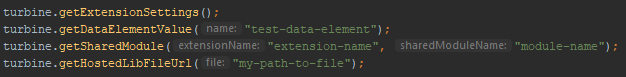
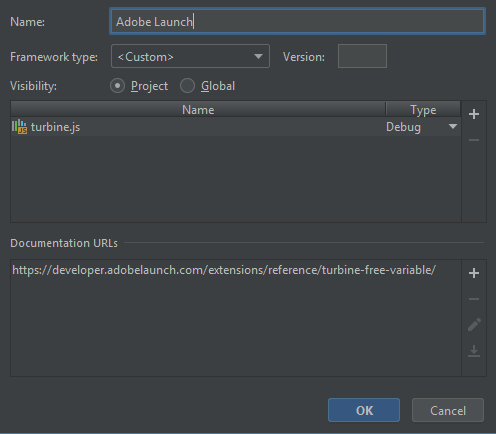

# Adobe Launch `turbine` type hinting dummy for IDEs

This repository adds code autocomplete and documentation for the [Turbine library](https://github.com/Adobe-Marketing-Cloud/reactor-turbine) (Adobe Launch's rule engine) to 
[JetBrain's Webstorm](https://www.jetbrains.com/webstorm/). While this was specifically created for WebStorm, other 
IDEs should be able to accept this dummy file - the method of adding it to the IDE may be different. The easiest way would be to add the file to your code base, but add a `.gitignore` rule to make sure you're not including it in your repository. 

An example of hinting at the parameters for the `turbine` methods:

    

Learn more about... 

 * [Adobe Launch](https://www.adobe.com/experience-platform/launch.html)
 * [The Reactor Engine](https://github.com/Adobe-Marketing-Cloud/reactor-turbine)
 * [The Turbine "free" variable](https://developer.adobelaunch.com/extensions/reference/turbine-free-variable/)
 * [Developing a Launch Extension](https://developer.adobelaunch.com/extensions/)

### Installing in WebStorm

Below are the steps to install this dummy file in WebStorm 2019. Earlier versions will be very similar, but the path to 
the JS library settings has changed slightly over the years.

1. Clone or download this repository on your local machine

1. Navigate to the following the JS Library settings: `File > Settings > Languages & Frameworks > JavaScript > Libraries`

1. Click on "Add"

1. Enter a name that is descriptive (e.g. "Adobe Launch")

1. Select "Framework Type" as `<Custom>`, and leave the "Version" field blank

1. Select the "Visibility" you want - it's recommended to leave this as "Project", otherwise all of your other projects 
will have access to the `turbine` variable in code autocomplete.

1. Add a new file (the "+" on the right), and select "Attach Files"

1. Navigate to the `turbine.js` file that you cloned/downloaded in the first step. You can leave the type set to "Debug".
    
1. (Optional, but recommended) Add a Documentation URL at the bottom, using 
`https://developer.adobelaunch.com/extensions/reference/turbine-free-variable/` as your URL. This will allow you to hit 
`Shift + F1` and navigate directly to the Launch documentation.

1. Finally, click "OK" on the library popup, and then "Apply" on the settings popup. You **must hit apply** in order 
for the settings to save and the `turbine` variable to be included in code completion.

The final JS library dialog should look similar to this:

    

Once this has been configured properly, you can hit `Alt + Q` to see the quick documentation. 
[Learn more about code references in WebStorm](https://www.jetbrains.com/help/webstorm/viewing-reference-information.html)
